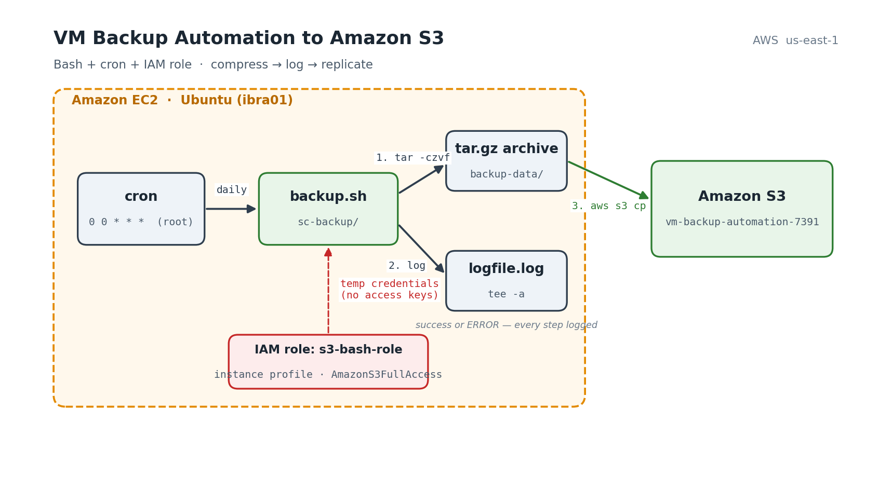
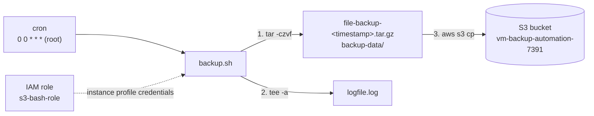
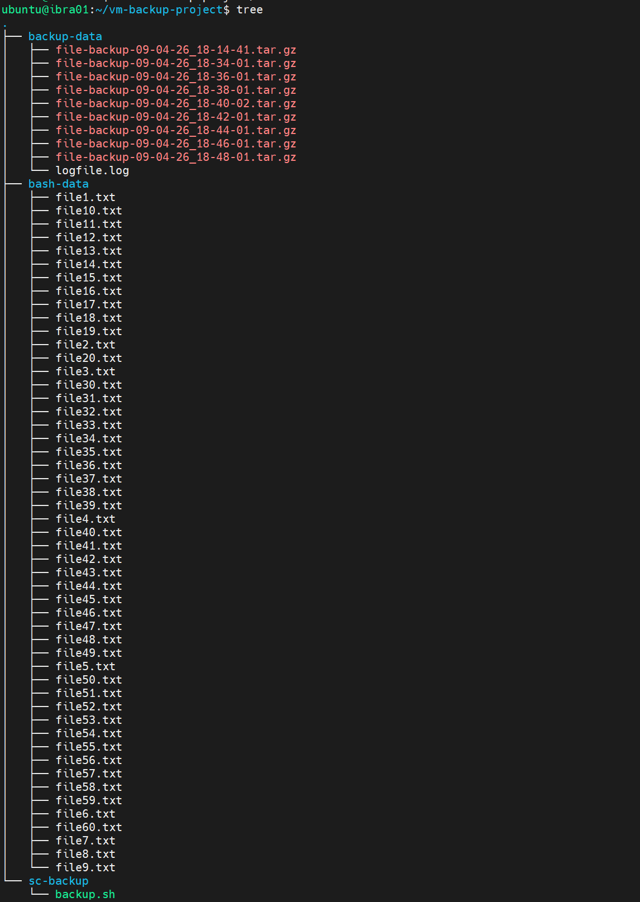
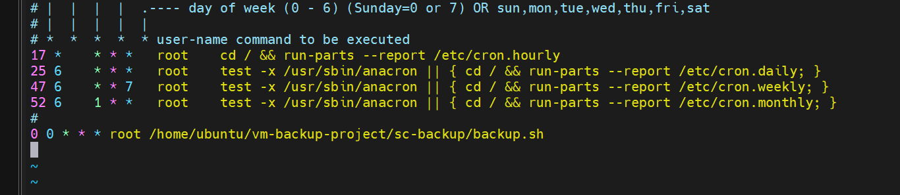
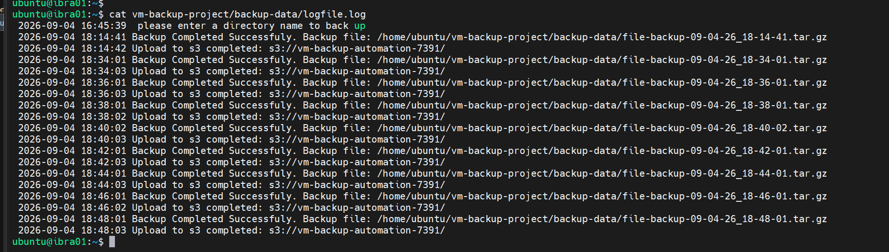
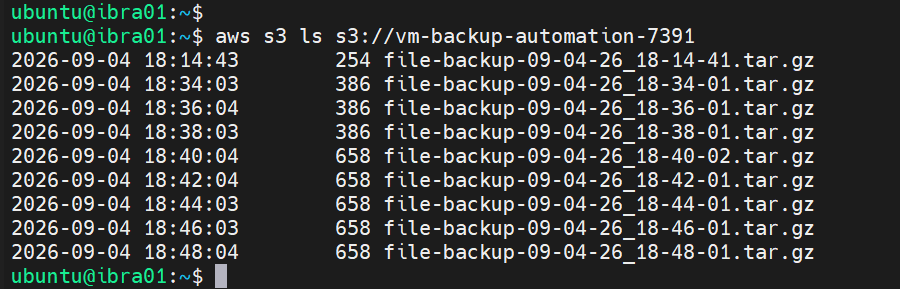
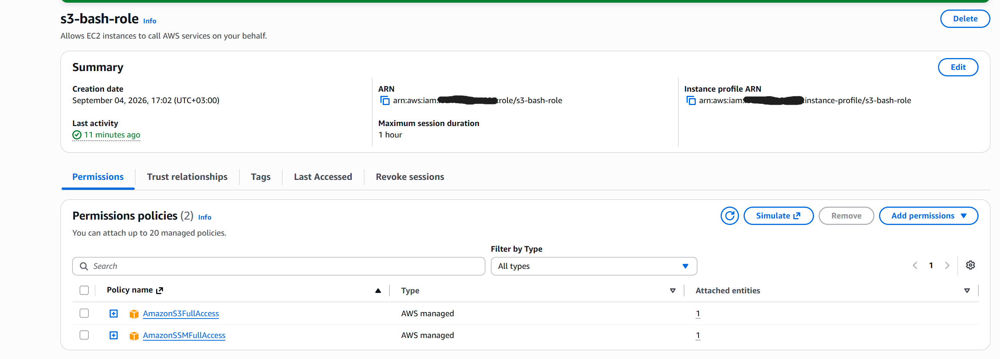
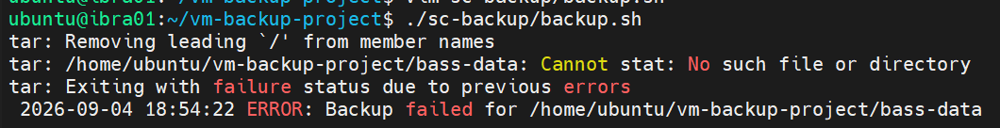
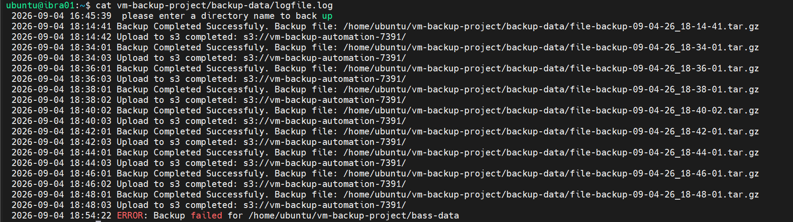

# VM Backup Automation to Amazon S3 — Bash + Cron + IAM


A hands-on automation project: a Bash script running on an Ubuntu EC2 instance that **compresses a data directory, logs every operation with a timestamp, and replicates the archive to Amazon S3** — scheduled with cron and authenticated through an **IAM instance role** (no access keys stored on the machine).

Every run either produces a timestamped `.tar.gz` in S3 or a clear `ERROR` line in the log — nothing fails silently.

---

## Architecture





**Execution flow**

1. Cron triggers `backup.sh` as root at midnight every day
2. The script checks that the AWS CLI is installed — exits with code `2` if not
3. Guards against overwriting an archive with the same timestamp
4. Compresses `bash-data/` into `backup-data/file-backup-<MM-DD-YY_HH-MM-SS>.tar.gz`
5. Uploads the archive to S3 with `aws s3 cp` using credentials from the instance role
6. Every step — success or failure — is appended to `logfile.log` via `tee -a`

---

## Resources Built

| Layer | Resource | Details |
|---|---|---|
| Compute | EC2 instance | Ubuntu, hostname `ibra01`, AWS CLI installed |
| Storage | S3 bucket | `vm-backup-automation-7391` — destination for all archives |
| Access | IAM role `s3-bash-role` | Attached to the instance as an instance profile — `AmazonS3FullAccess` + `AmazonSSMFullAccess` |
| Automation | Bash script | `sc-backup/backup.sh` — compress → log → upload |
| Scheduling | Cron (`/etc/crontab`) | `0 0 * * * root /home/ubuntu/vm-backup-project/sc-backup/backup.sh` |
| Observability | Log file | `backup-data/logfile.log` — timestamped line per operation |

---

## Project Layout

```
vm-backup-project/
├── backup-data/                          # generated archives + log
│   ├── file-backup-09-04-26_18-14-41.tar.gz
│   ├── file-backup-09-04-26_18-34-01.tar.gz
│   ├── ...
│   └── logfile.log
├── bash-data/                            # source data being backed up (file1.txt … file60.txt)
└── sc-backup/
    └── backup.sh                         # the automation script
```

---

## Design Decisions

**Why an IAM role instead of access keys?**
The instance role delivers temporary credentials through the instance metadata service, so the AWS CLI authenticates without any secret stored on disk or in the script. Nothing to rotate, nothing to leak if the script is shared — which is exactly why it can live in a public repo.

**Why `tee -a` for logging?**
Each message goes to both stdout and the log file in one line. When the script runs interactively you see the output; when cron runs it, the log file is the source of truth.

**Why check for an existing archive before compressing?**
The filename includes seconds, so a collision is unlikely — but if it happens (a manual run right after a cron run), the script refuses to overwrite and logs an `ERROR` rather than silently replacing a good backup.

**Why check `$?` after both `tar` and `aws s3 cp` separately?**
A backup that compressed fine but never reached S3 is still a failed backup. Checking each exit code separately produces a log that tells you *which* step failed, not just *that* something failed.

**Why exit code `2` when the AWS CLI is missing?**
A non-zero, non-`1` code makes this precondition failure distinguishable from a runtime failure when checking `$?` from cron or another script.

---

## Build Phases

1. **S3 + IAM** — created the bucket `vm-backup-automation-7391`, the role `s3-bash-role` with S3 and SSM permissions, and attached it to the EC2 instance
2. **Script** — wrote `backup.sh`: AWS CLI check, duplicate guard, `tar` compression, `aws s3 cp` upload, timestamped logging on every branch
3. **Manual test** — ran the script by hand, confirmed the archive in `backup-data/` and in the bucket
4. **Scheduling** — added the root cron entry in `/etc/crontab`; temporarily ran it every 2 minutes to verify the schedule fires, then set it to daily at midnight
5. **Failure test** — deliberately broke the source path to confirm the error branch logs correctly

---

## Verification

**Project tree** — archives accumulating in `backup-data/` alongside the log



**Cron entry** in `/etc/crontab`



**Log file** — one `Backup Completed` + one `Upload to s3 completed` line per run



**S3 bucket contents** — every archive replicated



**IAM role** `s3-bash-role` with its attached policies



---

## Failure Test — proving the error path works

A backup script that only logs successes is useless the day something breaks. To verify the error branch, the source directory in the script was changed to a non-existent path (`bass-data` instead of `bash-data`) and the script was run manually.

**Result:** `tar` failed with a non-zero exit code, the script skipped the S3 upload entirely, and logged an `ERROR` line with the path that failed.



The log file after the test — successful runs above, the failure clearly marked at the bottom:



The path was then restored to `bash-data` and the next cron run succeeded normally.

---

## Log Reference

Every line in `logfile.log` starts with `YYYY-MM-DD HH:MM:SS`. Possible messages:

| Message | Meaning |
|---|---|
| `Backup Completed Successfuly. Backup file: <path>` | `tar` succeeded |
| `Upload to s3 completed: s3://<bucket>/` | `aws s3 cp` succeeded |
| `ERROR: Backup failed for <path>` | `tar` failed — upload skipped |
| `ERROR: S3 upload failed for <path>` | archive created locally but not replicated |
| `ERROR file <path> already exists!` | duplicate timestamp — nothing overwritten |
| `AWS CLI is not installed. Please install it first.` | precondition failed — exit code `2` |

---

## Setup

```bash
# 1. On the EC2 instance — AWS CLI
sudo apt update && sudo apt install -y awscli    # or install AWS CLI v2

# 2. Attach an IAM role with S3 permissions to the instance (Console → EC2 → Actions → Security → Modify IAM role)

# 3. Place the script and make it executable
mkdir -p ~/vm-backup-project/{bash-data,backup-data,sc-backup}
cp backup.sh ~/vm-backup-project/sc-backup/
chmod +x ~/vm-backup-project/sc-backup/backup.sh

# 4. Edit the variables at the top of backup.sh (source dir, destination, bucket name)

# 5. Schedule it
echo "0 0 * * * root /home/ubuntu/vm-backup-project/sc-backup/backup.sh" | sudo tee -a /etc/crontab
```

---

## Skills Demonstrated

Bash scripting (conditionals, exit codes, command substitution) · Linux cron scheduling · `tar`/`gzip` archiving · AWS CLI · Amazon S3 · IAM roles and instance profiles · Structured logging with `tee` · Failure-path testing

---

Built as a hands-on Linux/AWS automation project — September 2026.
